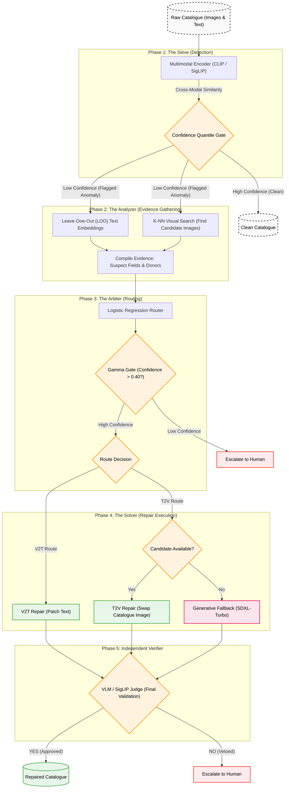

# TIGeR Pipeline Architecture

The following diagram illustrates the complete, end-to-end workflow of the **Text-Image Generative Repair (TIGeR)** pipeline. It details the journey of a product record from raw input, through anomaly detection (Sieve), evidence gathering (Analyzer), routing (Arbiter), repair execution (Solver with Generative Fallback), and final verification (VLM/SigLIP Judge).

You can render this diagram directly in markdown editors that support Mermaid (like GitHub, Notion, or Obsidian), or paste it into a live editor like [Mermaid Live](https://mermaid.live/) to export it as an SVG/PNG for your research paper.

### Component Details for the Paper:

1. **The Sieve:** Acts as the high-recall anomaly detector using contrastive embeddings (CLIP/SigLIP) to filter out clearly correct (clean) product rows.
2. **The Analyzer:** Generates actionable evidence by masking out individual text attributes (Leave-One-Out) and querying the visual catalogue (k-NN) for alternative donor images.
3. **The Arbiter:** A logistic regression model trained on simulated noise. It uses a **Gamma Gate** (adjustable confidence threshold, $\gamma = 0.40$) to decide whether it is safe to automate a repair, or if human escalation is required.
4. **The Solver:** Executes the structure-safe repair.
    - **V2T (Visual-to-Text):** Corrects erroneous text attributes based on visual evidence.
    - **T2V (Text-to-Visual):** Swaps a corrupted image with a valid donor.
    - **Generative Fallback:** If the catalogue lacks a donor, **SDXL-Turbo** synthesizes a new, attribute-weighted product image in 4 inference steps.
5. **Independent Verifier:** A secondary guardrail (Gemini 3.7 Flash or Local SigLIP) that checks the final proposed pair. It prevents "same-category wrong-direction" swaps from entering the database.
